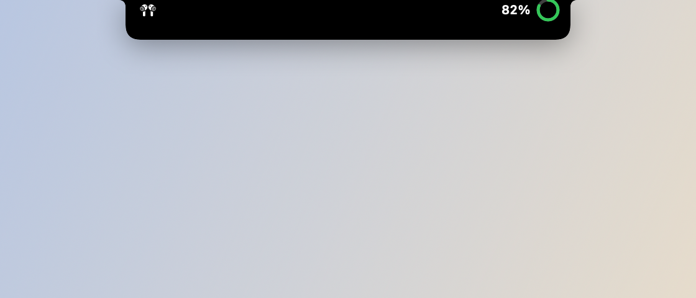
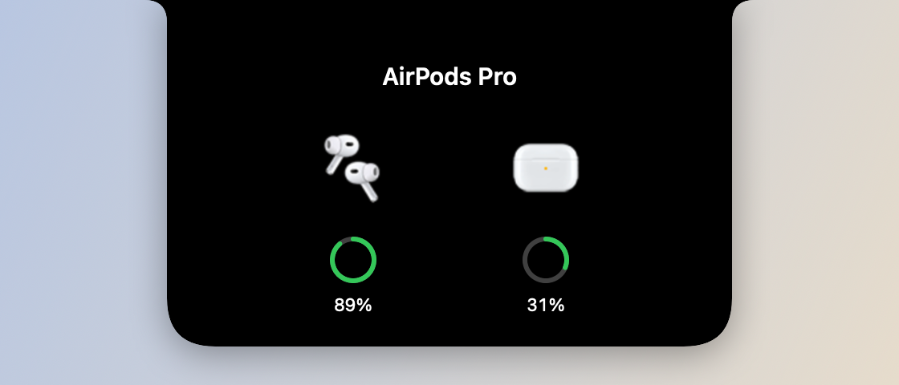
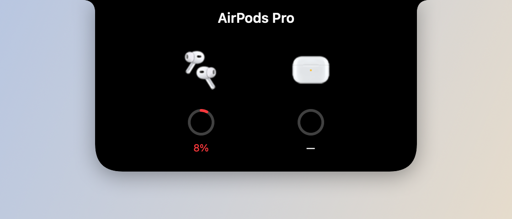

# AirPods no notch

*Conectou — o notch alarga, o fone quica e o anel mostra a bateria.*

*Passe o mouse na ilha — fones e estojo com as fotos do macOS e um anel cada.*

*Bateria baixa — o card abre sozinho, com a peça fraca em vermelho.*

## O que faz

Ao conectar os AirPods, o notch alarga por uns 3 segundos como a ilha do
iPhone: o ícone do seu modelo entra quicando e um anel verde enche até o
nível do fone mais descarregado. Passar o mouse na ilha abre o card, no
desenho do popup do iPhone: fones e estojo lado a lado, com as fotos reais
que o macOS usa no aviso de conexão, cada um com anel e porcentagem. Com 10%
ou menos, o card abre direto e o anel fica vermelho. Modelo sem foto no
sistema aparece com ícone.

O modelo (Pro, 1ª/2ª/3ª geração, 4) sai do identificador que o macOS
informa; modelo desconhecido usa o ícone dos AirPods Pro. AirPods Max ainda
não aparecem.

Com **Reduzir movimento** ligado no macOS, nada quica nem enche: os anéis
aparecem no nível certo.

A conexão é detectada por notificação do IOBluetooth; a bateria vem do
`system_profiler SPBluetoothDataType`, lido no connect e a cada 60 s
enquanto os AirPods seguem conectados.

## Como usar

- Não exige ação: conectar os AirPods já dispara o card sozinho.
- Pode ser desligado em Ajustes → Notch.

## Permissões

- **Bluetooth** — *"Knobler detecta seus AirPods pra mostrar a bateria e o card
  de conexão no notch."* Pedida no registro do monitor, logo após a abertura,
  quando o recurso está ligado em Ajustes → Notch. O estado dela aparece em
  [Ajustes → Permissões](settings.md#permissões), com o atalho pro painel do
  Ajustes do Sistema.
