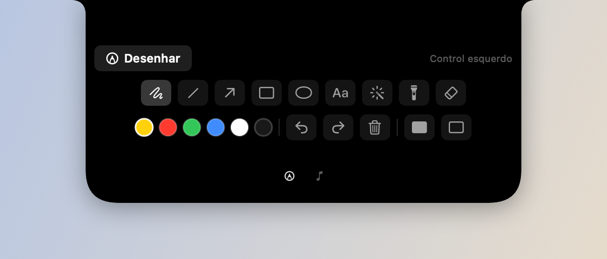
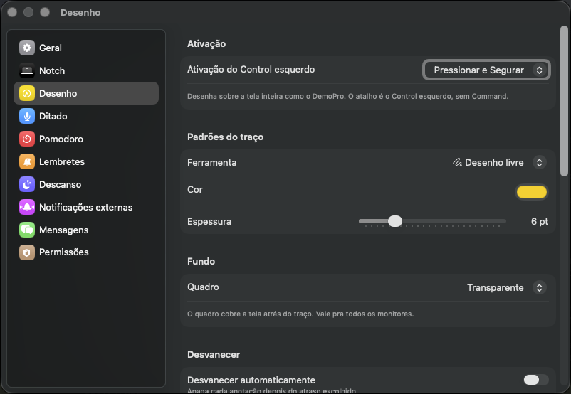

# Anotação de tela

O Knobler pode desenhar sobre a tela inteira, como o DemoPro, sem capturar nem
gravar o conteúdo que está por baixo.

## Uso

O atalho padrão é o **Control esquerdo**. No modo padrão, segure a tecla para
desenhar e solte para voltar a usar o Mac. O modo **Alternar** pode ser
escolhido em Ajustes › Desenho: uma pressão entra e outra sai.

A tecla liga e desliga só o **desenho**, não a visibilidade: o que já foi
desenhado continua na tela depois de soltar o Control, sem bloquear cliques.
O overlay só some sozinho quando não sobra nenhuma anotação.

## A seção Anotação do card

Ferramentas, cores e ações moram numa página do próprio notch — a seção
**Anotação**, sempre disponível na faixa do card (ícone de lápis). O menu da
barra de menus não tem nada disso.

- **Desenhar** liga e desliga o overlay sem usar a tecla.
- Linha do meio: desenho livre, linha, seta, retângulo, elipse, texto, laser,
  holofote e borracha.
- Linha de baixo: seis cores, desfazer, refazer, **apagar tudo** e os quadros
  branco e negro (clicar de novo volta pro fundo transparente).

O card fica **acima** do overlay: dá pra trocar de ferramenta no meio do
desenho, sem sair. Com a anotação ligada, o card abre já nessa seção.

### Atalhos enquanto desenha

| Tecla | Ação | Tecla | Ação |
|---|---|---|---|
| `'` | Texto | `L` | Laser |
| `S` | Desenho livre | `H` | Holofote |
| `Q` | Linha | `B` | Borracha |
| `A` | Seta | `U` | Desfazer |
| `Z` | Retângulo | `R` | Refazer |
| `E` | Elipse | `X` | Apagar tudo |
| `W` | Quadro branco | `K` | Quadro negro |

Esc para de desenhar (o traço fica), Delete apaga tudo, ⌘Z e ⇧⌘Z desfazem e
refazem.

## Quadro e persistência

O fundo pode ser transparente, branco ou negro. As anotações são salvas em
`~/Library/Application Support/Knobler/annotations/`, um arquivo JSON por
monitor, e restauradas na próxima execução. O auto-fade é opcional e pode ser
configurado em Ajustes › Desenho; laser e holofote desaparecem automaticamente.

## Ajustes › Desenho

O painel **Desenho** guarda o que não cabe na grade do card: o modo do Control
esquerdo, os **padrões do traço** (ferramenta, cor e espessura com que o desenho
nasce a cada lançamento — o card muda o traço da sessão, o painel muda o padrão),
o quadro de fundo, o auto-fade com o atraso, e a tabela de atalhos.

O recurso depende da permissão de Acessibilidade porque o atalho é detectado
por `CGEventTap`. Sem ela, o restante do app continua funcionando, mas o
Control esquerdo não ativa a anotação.

## Limites

O overlay não faz captura, gravação, OCR, colaboração ou edição de slides.
Essas funções devem continuar fora desta feature.
