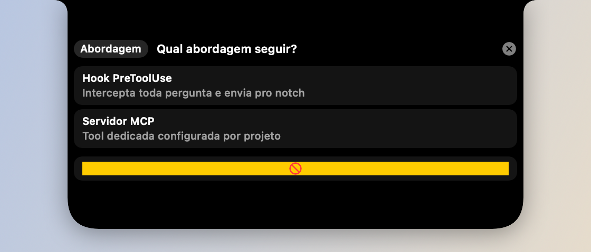
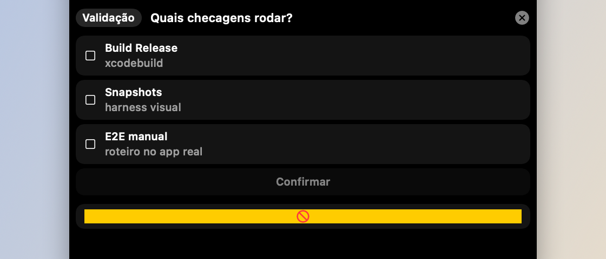

# Perguntas do Claude Code (Ask)



*Pergunta de escolha única.*



*Múltipla escolha.*

## O que faz

Quando o Claude Code usa a ferramenta `AskUserQuestion` (por exemplo, num hook
`PreToolUse`), a pergunta aparece como um card interativo no notch em vez de
ficar só no terminal — com opções de escolha única ou múltipla, e suporte a
perguntas em sequência (paginadas). Responder no card devolve a resposta pro
Claude via o mesmo hook que publicou a pergunta.

## Como usar

- Não exige ação manual do lado do Knobler: um hook `PreToolUse` do seu
  projeto Claude Code publica a pergunta via `POST /ask` na API local
  (ver `docs/local-api.md`); o card aparece sozinho.
- Clique numa opção (ou marque várias, se for múltipla escolha) e confirme.

Para instalar o hook globalmente no Claude Code:

```bash
./tools/claude-hook/install.sh
```

Ele passa a valer na próxima sessão do Claude Code. O hook não torna o Ask
obrigatório: se o Knobler estiver desligado, a pergunta continua no terminal.

## Permissões do Claude

O instalador também registra o hook nativo `PermissionRequest`. O pedido mostra
ferramenta, detalhes e sugestões no NOB, sem executar comandos. **Permitir**
aprova só a operação atual. **Permitir na sessão** só cria regras em memória
para a sessão atual; não grava permissões persistentes. Se a API ou o token não
estiverem disponíveis, o hook não devolve decisão e Claude mantém o prompt
nativo no terminal.

## Contrato e ciclo de vida

O fluxo usa a API local documentada em [`docs/local-api.md`](local-api.md):

1. o hook gera um ID e faz `POST /ask`;
2. o Knobler enfileira a pergunta no `AskStore` compartilhado por todos os
   monitores;
3. a resposta ou o cancelamento é enviado ao servidor;
4. o hook faz polling em `GET /ask/<id>` até obter uma resposta, cancelamento
   ou falha de comunicação.

O primeiro resultado vence. Respostas são consumidas uma única vez; perguntas
órfãs expiram após 15 minutos. Desligar a API limpa a apresentação e invalida
callbacks antigos.

Para desenvolvedores, `AskReducer` é a lógica pura de estado e
`AskStore` é o runtime `@MainActor` que executa os efeitos de resolve/cancel.
O reducer não conhece HTTP, AppKit ou SwiftUI. O mapa completo está em
[`docs/architecture.md`](architecture.md).

## Permissões

Nenhuma permissão especial — só a API local (`127.0.0.1:4477`), que não
exige permissão de sistema.
