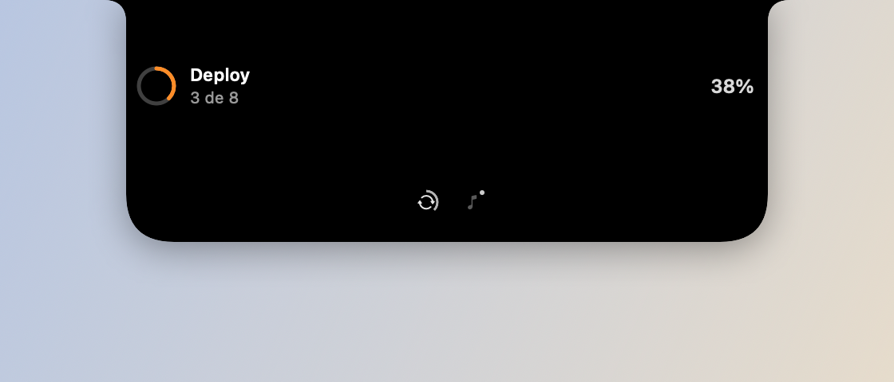

# Countdown de calendário

*O countdown usa o mesmo anel de "live activity" genérico do Knobler — não
tem uma UI própria separada.*

## O que faz

O próximo evento do seu calendário vira uma "live activity" no notch: entra
15 minutos antes com um anel que esvazia até a hora do evento, mostra "agora"
no início e some 1 minuto depois. Usa o mesmo mecanismo de atividade que a
API local usa pra deploys/builds — visualmente é o anel de progresso genérico
do Knobler.

## Como usar

- Não exige ação: com a permissão concedida, o próximo evento aparece
  sozinho 15 minutos antes.
- Pode ser desligado em Ajustes → Notch.

## Durante o Pomodoro

O Pomodoro toma o lugar da atividade no notch, então o countdown apareceria só
depois do foco acabar. Pra evitar isso, o evento entra no próprio card do
Pomodoro (linha abaixo do timer) e toma a pílula fechada nos últimos 5 minutos.
Detalhes em [pomodoro.md](pomodoro.md).

## Permissões

- **Calendário (acesso completo)** — *"Knobler mostra a contagem regressiva
  do próximo evento no notch."* Pedido na primeira execução; se negado, a
  feature fica quieta (sem erro, sem retry insistente).
