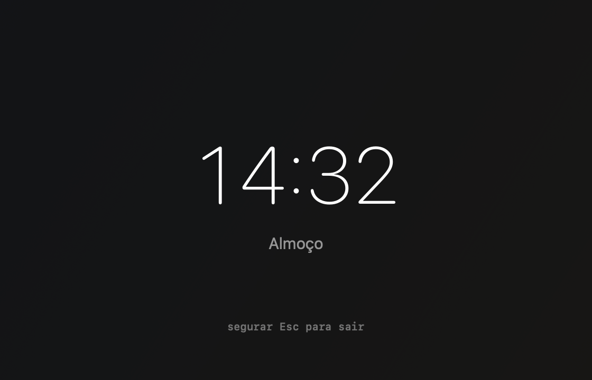
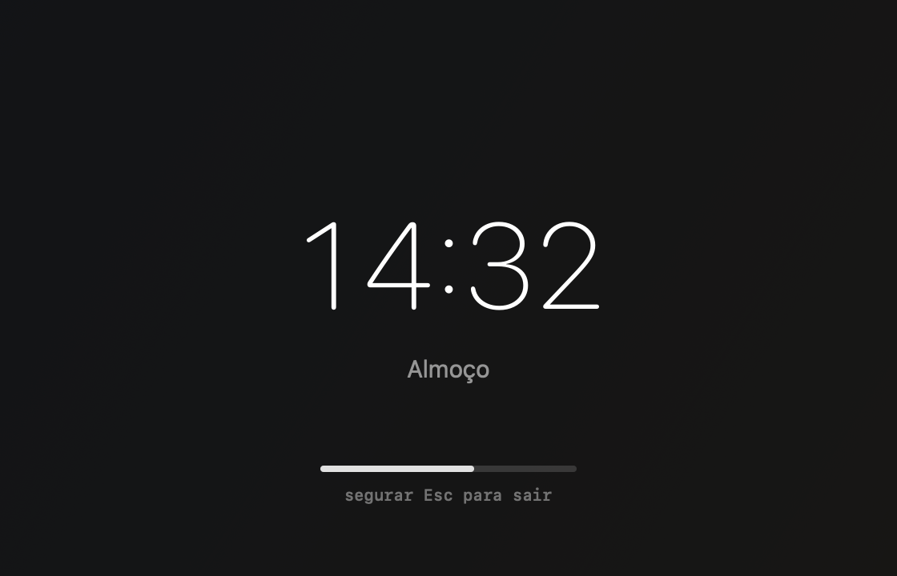
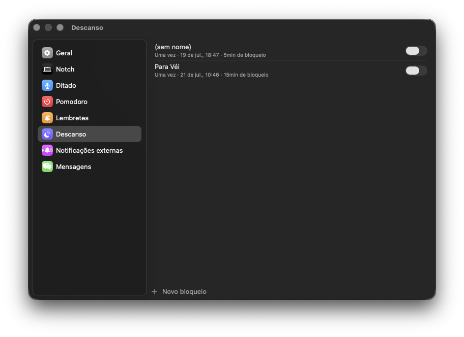

# Descanso

*Aviso antes do bloqueio.*

*Bloqueio forçado — segurar pra dispensar.*

*Ajustes → Descanso.*

## O que faz

Bloqueio de tela programado (ex.: hora do almoço) — reusa o mesmo motor de
agenda dos Lembretes, mas com uma duração: quanto tempo a tela fica travada.
Um overlay cobre a tela inteira; dispensar antes da hora exige segurar o
clique (evita fechar sem querer no automático).

## Como usar

- Criar/editar horários e duração do descanso: Ajustes → Descanso.
- Pra dispensar antes do fim: segure o clique no overlay (não é um clique só).

## Permissões

Nenhuma permissão especial.
