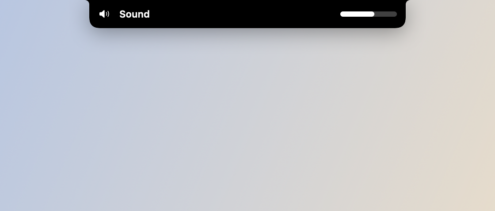
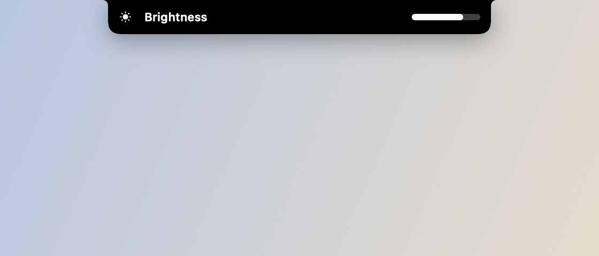
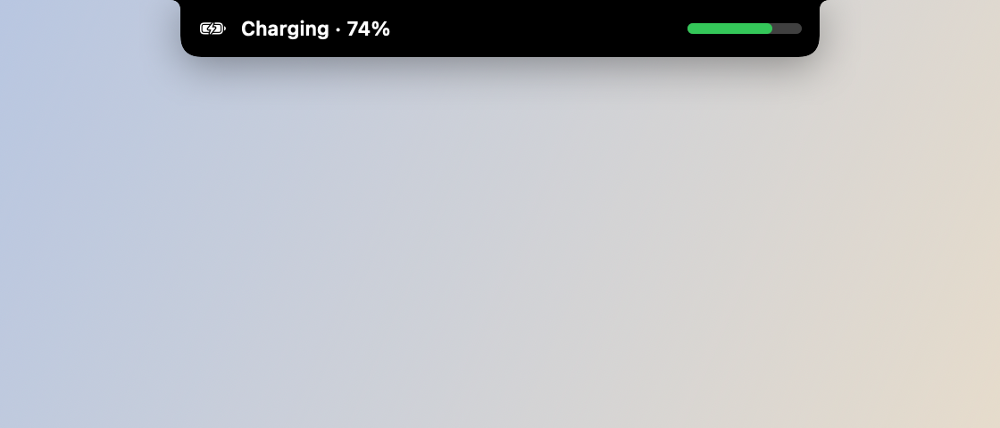

# HUDs (volume, brilho, bateria)

*Volume.*

*Brilho.*

*Bateria (conectou o carregador, ou cruzou 20%).*

## O que faz

Substitui o HUD nativo do macOS por uma versão no notch: as teclas de volume e
brilho são interceptadas via `CGEventTap` (evento `NX_SYSDEFINED`) antes do
sistema desenhar o balão nativo — o OSD do macOS nunca chega a aparecer. A
bateria também vira um HUD: dispara quando o carregador conecta/desconecta e
uma vez ao cruzar 20%.

## Como usar

- Aperte as teclas de volume ou brilho normalmente — o HUD aparece no notch
  em vez do balão do sistema.
- Conecte/desconecte o carregador, ou deixe a bateria cruzar 20%, pro HUD de
  bateria aparecer sozinho.
- Cada HUD pode ser ligado/desligado em Ajustes → Notch.

## Permissões

- **Acessibilidade** — necessária pro `CGEventTap` interceptar as teclas antes
  do sistema. Em teclado Apple **externo**, as teclas de brilho são
  consumidas abaixo da camada do tap — nesse caso só o HUD de volume funciona
  e o balão nativo de brilho ainda aparece.
