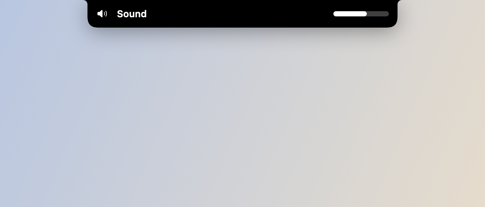
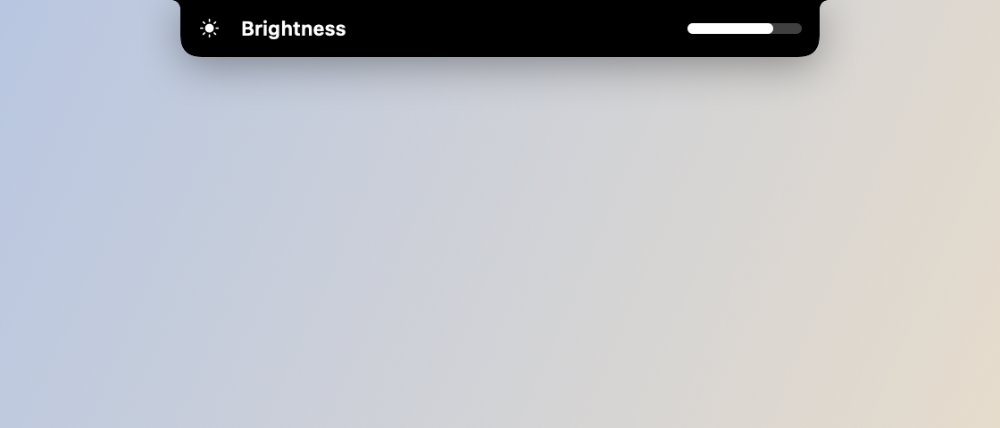
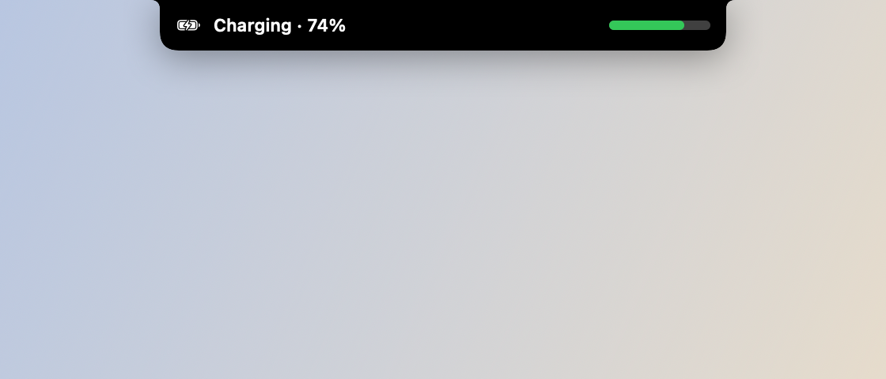

# HUDs (volume, brilho, bateria)

*Volume.*

*Brilho.*

*Bateria (conectou o carregador, ou cruzou 20%).*

## O que faz

Substitui o HUD nativo do macOS por uma versão no notch: as teclas de volume e
brilho são interceptadas via `CGEventTap` (evento `NX_SYSDEFINED`) antes do
sistema desenhar o balão nativo — o OSD do macOS nunca chega a aparecer. A
bateria também vira um HUD: dispara quando o carregador conecta/desconecta e
uma vez ao cruzar 20%.

## Como usar

- Aperte as teclas de volume ou brilho normalmente — o HUD aparece no notch
  em vez do balão do sistema.
- Conecte/desconecte o carregador, ou deixe a bateria cruzar 20%, pro HUD de
  bateria aparecer sozinho.
- Cada HUD pode ser ligado/desligado em Ajustes → Notch.

## Permissões

- **Acessibilidade** — necessária pro `CGEventTap` interceptar as teclas antes
  do sistema. Em teclado Apple **externo**, as teclas de brilho são
  consumidas abaixo da camada do tap — nesse caso só o HUD de volume funciona
  e o balão nativo de brilho ainda aparece.

## Com a peça Monitores

As teclas de brilho controlam a tela sob o cursor. O HUD mostra o nome da tela
afetada no notch correspondente; quando não há notch disponível nessa tela,
um notch existente mostra o destino. O painel de Monitores não é aberto.
Os sliders do painel não geram HUD.

Volume e mudo seguem a saída de áudio ativa e sua associação inequívoca a um
monitor. A associação pode ser definida nos ajustes de Monitores. O slider
do painel sempre controla a tela selecionada. Desligar a exibição do HUD não
desliga os controles; desativar a peça devolve as teclas ao comportamento
anterior. Veja [Monitores](monitores.md) para ajustes e limites de validação.
