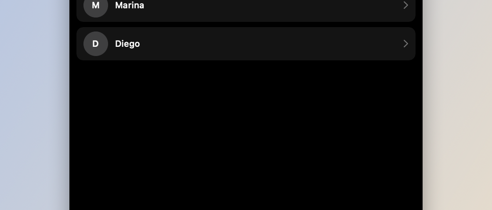
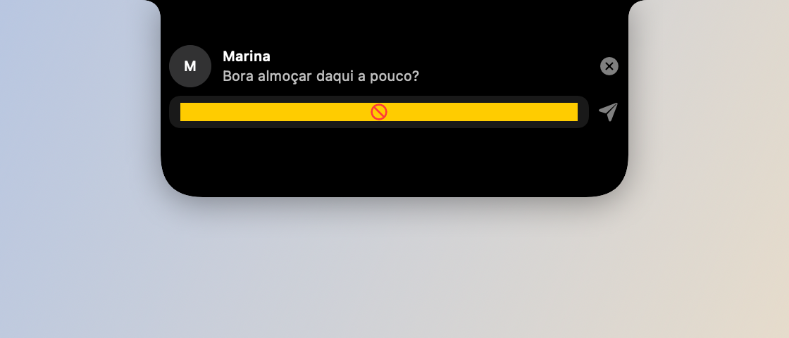
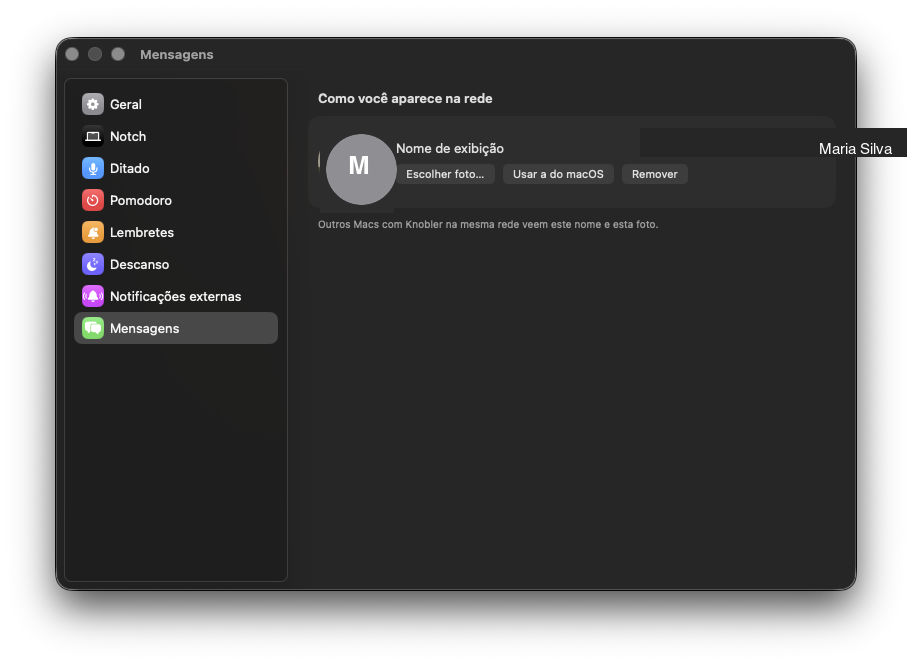

# Mensagens (LAN)

*Aba Mensagens — quem está online agora.*

*Mensagem chegando — desce do notch.*

*Ajustes → Mensagens (nome e foto que os outros veem).*

## O que faz

Troca mensagens (texto, foto, GIF) com outros Macs rodando Knobler na mesma
rede local — descoberta via Bonjour, sem servidor central. Uma mensagem
chegando aparece como um card que desce do notch, com resposta rápida opcional;
a aba "Mensagens" (segunda página do notch aberto, swipe horizontal) mostra
quem está online agora e o histórico por conversa.

## Como usar

- Gesto horizontal de dois dedos no notch aberto troca entre a aba de Música
  e a aba de Mensagens.
- Clique numa pessoa online pra abrir a conversa; escreva e envie texto, foto
  ou GIF.
- Nome e foto que os outros veem: Ajustes → Mensagens.

## Permissões

- **Rede Local** (`_knobler._tcp` via Bonjour) — *"Knobler troca mensagens
  com outros Macs na sua rede local."* Sem essa permissão, a aba mostra um
  aviso pedindo pra liberar em Ajustes do Sistema → Privacidade → Rede Local.
