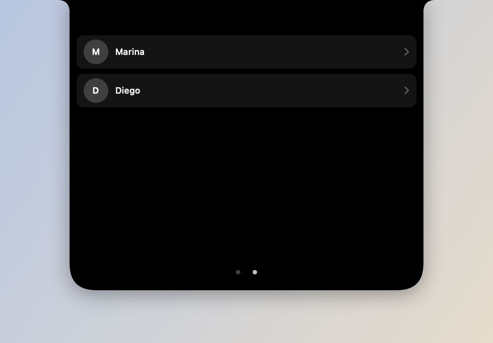
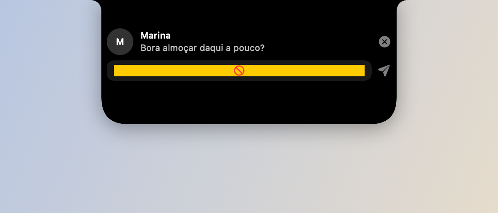
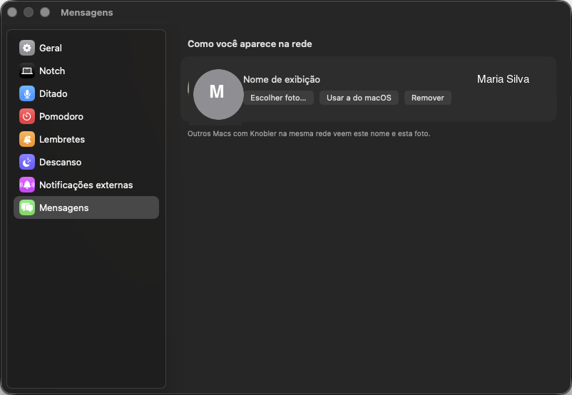

# Mensagens (LAN)

*Seção Mensagens em foco — quem está online agora.*

*Mensagem chegando — desce do notch.*

*Ajustes → Mensagens (nome e foto que os outros veem).*

## O que faz

Troca mensagens (texto, foto, GIF) com outros Macs rodando Knobler na mesma
rede local — descoberta via Bonjour, sem servidor central. Uma mensagem
chegando aparece como um card que desce do notch, com resposta rápida opcional;
a seção "Mensagens" do notch aberto mostra quem está online agora e o
histórico por conversa.

## Como usar

- Com o card aberto, clique no ícone de balão na faixa do rodapé pra pôr
  Mensagens em foco (o gesto horizontal de dois dedos anda um passo na faixa e
  chega no mesmo lugar). Mensagem recém-chegada põe a seção em foco sozinha.
- Clique numa pessoa online pra abrir a conversa; escreva e envie texto, foto
  ou GIF. A conversa abre já na mensagem mais recente e segue colada nela
  quando chega uma nova — role pra cima pra ver o histórico.
- Nome e foto que os outros veem: Ajustes → Mensagens.

## Permissões

- **Rede Local** (`_knobler._tcp` via Bonjour) — *"Knobler troca mensagens
  com outros Macs na sua rede local."* Sem essa permissão, a seção mostra um
  aviso pedindo pra liberar em Ajustes do Sistema → Privacidade → Rede Local.
