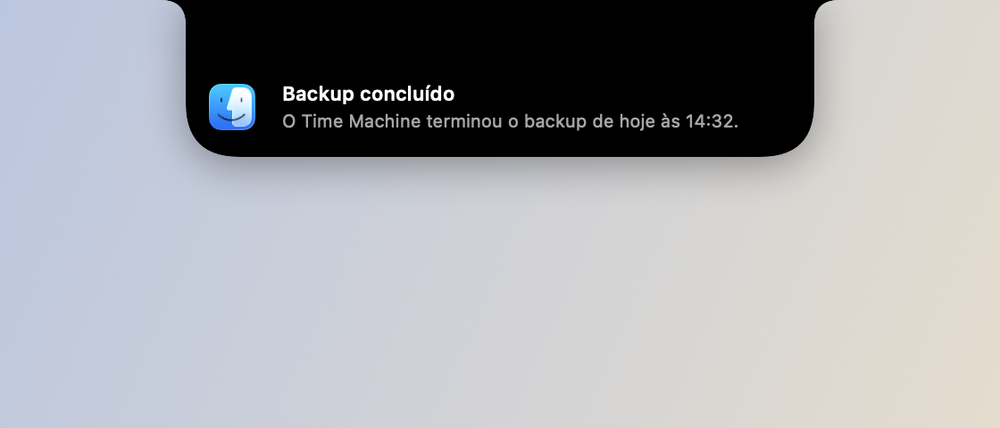

# Notificações do sistema

## O que faz

Intercepta banners de notificação do macOS via Accessibility — observa o
processo do Notification Center (`AXObserver` + polling de segurança), lê o
título/corpo do banner, fecha o balão nativo e mostra o mesmo conteúdo como um
card que desce do notch.

## Como usar

- Não exige ação: qualquer notificação do sistema que abriria o banner nativo
  passa a aparecer no notch automaticamente.
- Pode ser desligada em Ajustes → Notch.

## Permissões

- **Acessibilidade** — necessária pro `AXObserver` ler e fechar o banner
  nativo do Notification Center.
