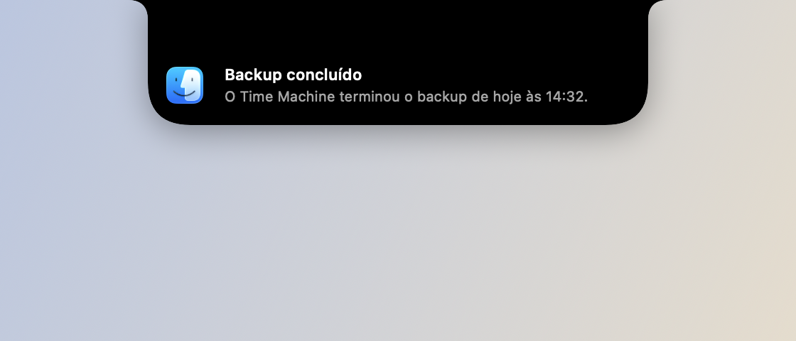

# Notificações do sistema

## O que faz

Intercepta banners de notificação do macOS via Accessibility — observa o
processo do Notification Center (`AXObserver` + polling de segurança), lê o
título/corpo do banner, fecha o balão nativo e mostra o mesmo conteúdo como um
card que desce do notch.

## Como usar

- Não exige ação: qualquer notificação do sistema que abriria o banner nativo
  passa a aparecer no notch automaticamente.
- Pode ser desligada em Ajustes → Notch.

## O que NÃO é engolido

Dois casos em que o alerta do sistema **continua na tela** e o card do notch é
só um espelho:

- **AirDrop.** O alerta acompanha uma transferência viva; fechá-lo interrompia o
  recebimento. O card mostra 📥 e clicar nele revela a pasta Downloads.
- **Alertas com botão** (Aceitar/Recusar e afins). Exigem decisão, então o
  original fica de pé. Os botões são espelhados no card: clicar no notch aciona
  o botão real via Accessibility, e o card espera 30s em vez de 5s. Se algo der
  errado no espelho, o alerta do sistema continua ali pra você responder.

O `Fechar`/`Limpar` do próprio alerta nunca vira botão do card.

## Silêncio durante reuniões

Com **Ajustes › Notch › Silenciar durante reuniões** ligado, notificação de app,
da API local e de webhook **não vira card** enquanto uma reunião acontece. Ela
não some: vai direto pro Histórico, e está lá quando a reunião acabar.

Continuam aparecendo normalmente: **lembretes**, **Pomodoro**, perguntas do
Claude e o conta-gotas. São coisas que você mesmo agendou — engoli-las seria
perder o alarme que você pediu, não filtrar ruído.

"Reunião" é um evento do calendário **acontecendo agora** e **com link de call**
(Zoom, Meet, Teams, Webex, Whereby, Jitsi). Evento comum de agenda não conta:
"Almoço" e "Aniversário da Ana" não silenciam nada. Evento de dia inteiro também
não — senão um aniversário calaria o notch o dia todo.

A opção é **opt-in** e depende da contagem do calendário estar ligada, que é
quem sabe o que está em curso. Microfone em uso foi recusado como sinal: o
ditado do próprio Knobler o acende, e o notch silenciaria toda vez que você
falasse.

## Permissões

- **Acessibilidade** — necessária pro `AXObserver` ler e fechar o banner
  nativo do Notification Center.

<!-- TODO screenshot: seção de histórico em foco, com a faixa de ícones no rodapé do card -->

## Histórico (24 h)

Tudo que virou card no notch fica registrado por 24 h: banner de sistema
interceptado, card de webhook, lembrete disparado, fim de fase do Pomodoro e
cor copiada pelo conta-gotas. Não é um log separado — é o mesmo conteúdo que
já passou pelo card, guardado pra consulta. Atividade da API local (a linha
de progresso do deploy) **não** entra: ela não é card, é uma faixa que vive
no notch enquanto dura.

### Como abrir

O histórico é uma **seção** do card aberto, como Música ou Pomodoro: abra o
card (swipe de dois dedos pra baixo, ou hover) e clique no ícone de sino na
faixa do rodapé — ou deslize na horizontal até chegar nele. Quando uma
notificação acabou de passar, o histórico sobe sozinho pro foco por alguns
segundos; depois disso a ordem volta a ser a dos Ajustes → Notch.

Clicar num ícone trava o foco: nenhuma promoção o tira até o notch recolher.

### Como fechar

Fechar não é gesto — é tirar o mouse de cima do notch, o mesmo hover-out que
já fecha o card. Com o histórico em foco, o scroll vertical pertence à lista
(ela realmente rola, com momentum incluso) — mas só quando há lista pra rolar:
com o histórico vazio o gesto continua valendo pra fechar. Clicar numa linha
também recolhe o notch, junto com abrir a origem.

A nota rápida é modo exclusivo: com a nota em foco a faixa some e o swipe
horizontal fica desligado — o card é da nota, e nada oferece um caminho pra
fora do campo de texto.

### O que aparece em cada linha

Horário à esquerda, nome do app, título e corpo truncado numa linha. **Sem
ícone do app** — `NSWorkspace.icon(forFile:)` não renderiza no harness de
snapshot offscreen do projeto, então a linha ficou só com texto. Clicar numa
linha faz o mesmo que clicar no card original teria feito (abre a URL, foca o
app, revela a pasta do AirDrop) e recolhe o notch.

Quando não há nada nas últimas 24 h, a seção mostra "Nada nas últimas 24 h".

Um webhook que atualiza o mesmo `webhookID` várias vezes (por exemplo, uma
barra de progresso que muda 40 vezes) substitui a entrada anterior em vez de
empilhar — vira uma linha só no histórico, não quarenta.

### Sobrevive ao restart

O histórico é gravado em
`~/Library/Application Support/Knobler/notificationHistory.json` e recarregado
na abertura, já podado pela janela de 24 h — reiniciar o app (ou o Mac) não
perde nada.

Era só memória até o **silêncio durante reuniões** existir. A partir dele uma
notificação silenciada não vira card, e o histórico virou a única cópia dela:
um restart no meio da reunião apagaria a notificação inteira, sem você jamais
saber que ela existiu.

**Botão de notificação restaurada não volta.** Os botões espelhados
(Aceitar/Recusar, Adiar) apontam pra elementos vivos do alerta original, que
morrem com o processo — um botão restaurado não faria nada. Depois do restart a
linha aparece com o texto, sem botão. O que continua funcionando é o clique que
abre app, URL ou pasta, porque isso é dado, não handle.

Os corpos das notificações ficam em claro nesse arquivo por 24 h — mesma
exposição do histórico de mensagens, que já mora na mesma pasta.

O histórico também tem teto de 300 linhas: uma fonte que dispare em rajada
não cresce sem limite dentro da janela de 24 h. Passando disso, a linha mais
antiga sai.
