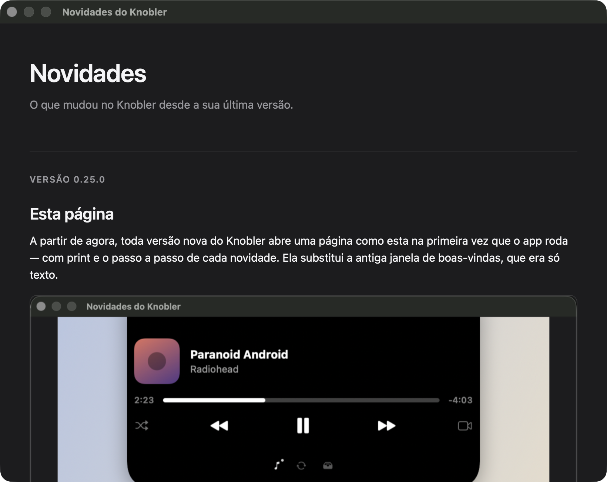

# Novidades

## O que faz

O Knobler é `LSUIElement`: não tem ícone no Dock nem janela principal. Sem uma
apresentação, quem instala fica sem saber onde o app está nem o que mudou de
uma versão pra outra. A página de novidades resolve isso: uma janela com
figura, passo a passo e botão de ação por versão, que abre sozinha na primeira
execução de cada atualização.

<!-- Captura: WKWebView não renderiza no tools/snapshot.sh, então a imagem é
     manual. Build Release, instalar em ~/Applications (não sobrescreva o app
     que já estiver rodando de /Applications — de /tmp o installIssue manda
     pro painel Permissões e a página nem abre), rodar
     `Knobler --novidades` (mostra tudo e não grava nada), achar o windowID em
     CGWindowListCopyWindowInfo (nome "Novidades do Knobler") e
     `screencapture -o -l<id>` — sai em @2x, sem sombra e sem halo, não
     precisa recortar. -->

A janela é informativa: não liga nem desliga nada. Ditado, Mensagens e API
local já nascem ligados, e o que dá pra mudar mora em Ajustes.

## Como usar

- **Primeiro launch de cada versão nova:** a página abre sozinha, ativando o
  app. Fecha no X ou no Esc, e não volta a aparecer naquela versão.
- **Quem pulou versões** vê todas as que ficaram pra trás numa página só, da
  mais nova pra mais antiga — não é preciso abrir uma de cada vez.
- **Na primeira execução de verdade** (instalação limpa, sem nenhuma versão
  vista ainda), a página mostra só a boas-vindas — o histórico inteiro seria
  longo demais pra primeira impressão — e, ao fechar, encadeia o painel
  **Ajustes → Permissões**, que é quem pede Acessibilidade. Em qualquer
  execução seguinte (já com alguma versão vista) fechar a página não abre
  Permissões: quem chegou até aqui já passou por esse painel antes.
- **Reabrir quando quiser:** menu da barra (**◐**) → **Novidades…**, que
  mostra tudo (o histórico completo, não só o pendente) e **não** marca nada
  como visto — reler não altera o que a próxima versão vai mostrar.
- **`Knobler --novidades`** (linha de comando): mesma coisa que o item de
  menu — mostra tudo, não grava. É o modo usado pra capturar screenshot sem
  queimar o estado da máquina.

⚠️ A janela é reusada: se ela abrir sozinha num launch e você abrir o item de
menu logo em seguida, **antes de fechar a primeira**, continua vendo só as
páginas com que a janela nasceu (as pendentes), não o histórico completo.
Feche e reabra pelo menu pra ver tudo.

## Permissões

A página em si não pede nenhuma. A Acessibilidade é pedida pelo painel
Permissões, encadeado só na primeira execução de verdade (ver acima) —
recusar não derruba o app, só o ditado e a interceptação de notificações, e o
aviso ⚠ fica no menu da barra até você conceder. Concedida, os recursos
religam em poucos segundos, sem reabrir o app.

## Limitação conhecida

A mídia de cada versão é PNG, não vídeo: um `<video>` embarcado não toca na
`WKWebView` da janela (`NotAllowedError`, mesmo mudo e com a configuração
correta de autoplay). Até isso ser investigado, cada novidade ilustra com uma
captura de tela estática.
