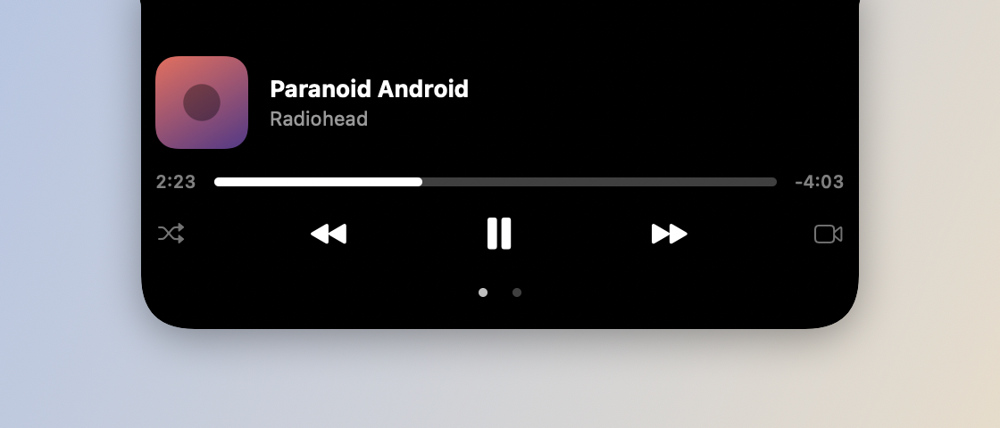

# Now Playing

*Fechado — capa + visualizador.*

*Aberto (hover) — controles, progresso e shuffle.*

## O que faz

Mostra o que está tocando no Spotify ou Apple Music — capa do álbum e um
visualizador de áudio animado no notch fechado; passar o mouse expande com
controles de play/pause, próxima/anterior, barra de progresso e shuffle. O
visualizador usa um tap de áudio real via CoreAudio (FFT em 5 bandas) no
processo do player, como o Dynamic Island do iPhone — as barras dançam com a
música de verdade, tingidas pela cor dominante da capa. Sem áudio real
disponível (ou sem a permissão concedida), cai num visualizador sintético.
Música pausada some do notch; passar o mouse "espia" antes de comprometer a
abertura.

## Como usar

- Hover no notch fechado expande; tirar o mouse fecha.
- Dois dedos pra baixo abre, pra cima fecha, gesto horizontal pula faixa.
- Funciona com qualquer app que apareça no Control Center (Now Playing
  universal via `mediaremote-adapter`) — não é exclusivo de Spotify/Apple Music.
- Em monitores externos (sem notch físico), a mesma UI aparece numa ilha
  simulada no topo da tela.

## Permissões

- **Gravação de Áudio do Sistema** — *"Knobler lê o áudio do player para
  animar o visualizador no notch, como no iPhone."* Sem ela, o visualizador
  usa animação sintética em vez do áudio real.
- **Automação** (Spotify/Music) — necessária pros comandos de play/pause/skip.
