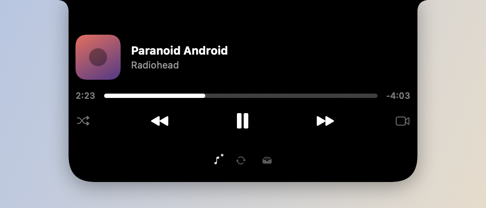

# Now Playing

*Fechado — capa + visualizador.*

*Aberto (hover) — controles, progresso e shuffle.*

## O que faz

Mostra o que está tocando no Spotify ou Apple Music — capa do álbum e um
visualizador de áudio animado no notch fechado; passar o mouse expande com
controles de play/pause, próxima/anterior, barra de progresso e shuffle. O
visualizador é o da Dynamic Island, nas mesmas medidas: seis barras que não são
pintadas, e sim o recorte por onde a capa desfocada aparece — por isso cada uma
tem um tom diferente da vizinha. Elas dançam com o áudio real do player, lido
por um tap via CoreAudio (FFT em 6 bandas) no processo dele. Sem áudio real
disponível (ou sem a permissão concedida), toca a animação de reserva que a
Apple usa no app Música. Música pausada continua no notch: a capa escurece e as
barras descansam em pontinhos redondos.

## Como usar

- Hover no notch fechado expande; tirar o mouse fecha.
- Dois dedos pra baixo abre, pra cima fecha. Com o notch **fechado**, o gesto
  horizontal pula faixa; com o card **aberto**, ele anda um passo na faixa de
  seções do rodapé (e trava o foco onde parar).
- Música é uma seção como as outras: se ela não estiver em foco, o ícone de
  nota musical no rodapé mostra um pontinho enquanto algo estiver tocando —
  clicar traz a seção de volta.
- Funciona com qualquer app que apareça no Control Center (Now Playing
  universal via `mediaremote-adapter`) — não é exclusivo de Spotify/Apple Music.
- Em monitores externos (sem notch físico), a mesma UI aparece numa ilha
  simulada no topo da tela.

## Permissões

- **Gravação de Áudio do Sistema** — *"Knobler lê o áudio do player para
  animar o visualizador no notch, como no iPhone."* Sem ela, o visualizador
  toca a animação de reserva da Apple em vez de seguir o áudio.
- **Automação** (Spotify/Music) — necessária pros comandos de play/pause/skip.
