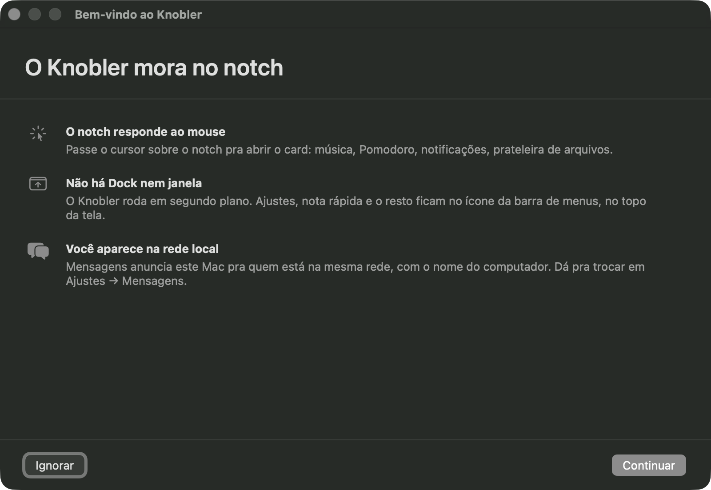
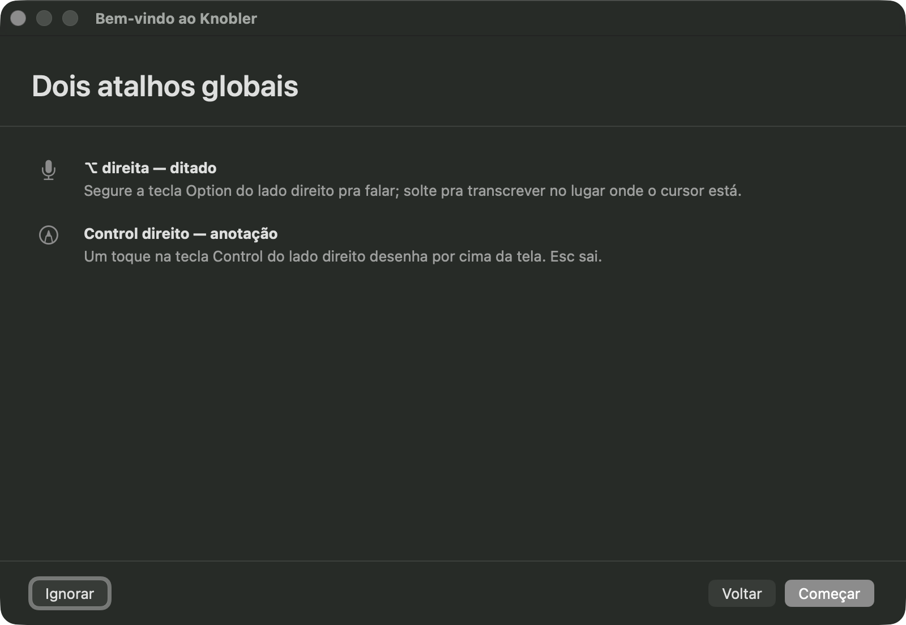

# Boas-vindas

## O que faz

O Knobler é `LSUIElement`: não tem ícone no Dock nem janela principal. Sem uma
apresentação, quem instala fica sem saber onde o app está nem que existem
atalhos globais. A janela de boas-vindas resolve isso na primeira abertura, em
dois passos:

1. **O Knobler mora no notch** — o notch responde ao mouse, o acesso é o ícone
   da barra de menus, e Mensagens anuncia este Mac na rede local com o nome do
   computador (editável em Ajustes → Mensagens).
2. **Dois atalhos globais** — ⌥ direita segura pra ditar, Control esquerdo abre
   a anotação de tela.

<!-- As duas imagens são MANUAIS: NSWindow real não renderiza no
     tools/snapshot.sh. Pra refazer: build Release, rodar o app de
     ~/Applications (de /tmp o painel Permissões toma a frente, por
     installIssue), `Knobler --boas-vindas`, achar o windowID em
     CGWindowListCopyWindowInfo e `screencapture -o -l<id>` — sai 1600x1104,
     já sem sombra e sem halo, não precisa recortar. -->

A janela é informativa: não liga nem desliga nada. Ditado, Mensagens e API
local já nascem ligados, e o que dá pra mudar mora em Ajustes.

## Como usar

- **Primeira abertura:** a janela aparece sozinha. "Continuar" anda os passos,
  "Começar" fecha no fim, e **"Ignorar"** (ou o X) fecha a qualquer momento —
  fechar no passo 1 conta como visto, o app não insiste.
- **Quando ela fecha**, o painel **Ajustes → Permissões** aparece em seguida.
  É ele quem pede Acessibilidade, a permissão de que o ditado e as notificações
  interceptadas dependem.
- **Ela não volta sozinha.** Só reaparece se uma versão futura trouxer um passo
  novo — e aí mostra **só** o passo novo, marcado "Novo" ou "Atualizado". Quem
  já usava o Knobler antes desta versão vê só o passo dos atalhos.
- **Reabrir quando quiser:** menu da barra (**◐**) → **Boas-vindas…**, que abre
  todos os passos.

## Permissões

A janela em si não pede nenhuma. A Acessibilidade é pedida pelo painel
Permissões logo depois — recusar não derruba o app, só o ditado e a
interceptação de notificações, e o aviso ⚠ fica no menu da barra até você
conceder. Concedida, os recursos religam em poucos segundos, sem reabrir o app.
