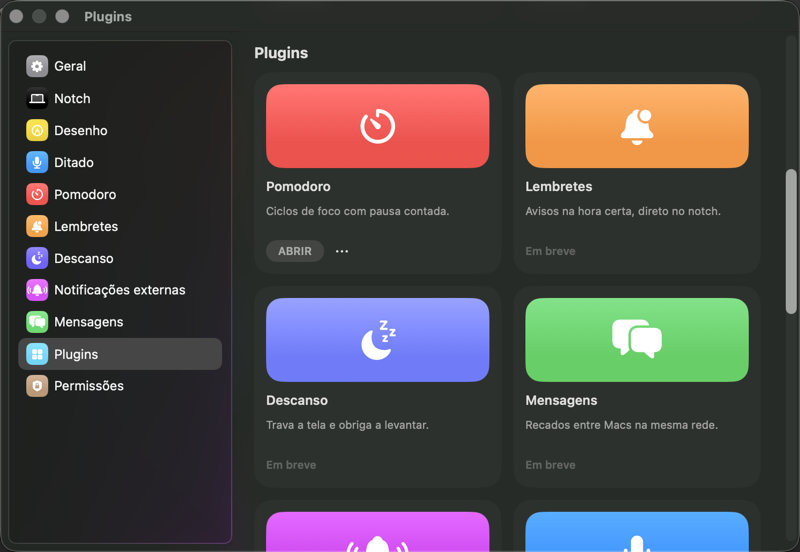
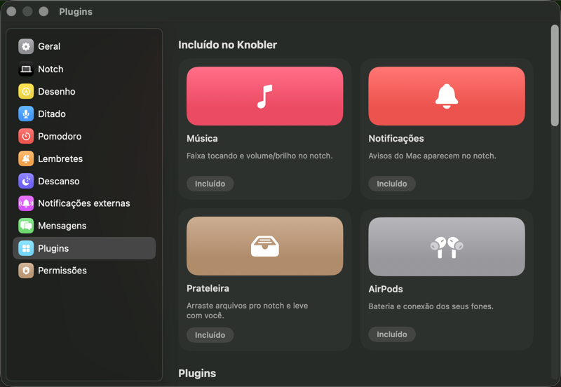

# Plugins

*Ajustes → Plugins: o Pomodoro instalado (ABRIR + ⋯) e as peças ainda não
convertidas ("Em breve").*

*O topo do painel: as quatro features de fábrica, sem ação.*

## O que faz

O Knobler é feito de peças. Cada feature tem um card em **Ajustes → Plugins**, e
a peça que você não usa pode ser desinstalada: ela deixa de existir no app —
sem timer rodando, sem painel na barra lateral, sem seção no card, sem linha no
menu da barra.

Nada é baixado. Todo o código já veio no app; instalar é ligar a chave.

## As duas seções

**Incluído no Knobler** — Música, Notificações, Prateleira e AirPods. São de
fábrica porque substituem algo que o macOS já fazia; não têm botão.

**Plugins** — as onze peças que acrescentam: Pomodoro, Lembretes, Descanso,
Mensagens, Webhooks, Ditado, Espelho, Desenho, Nota rápida, Preview de link e
Conversão de arquivo.

## Instalar e desinstalar

- Peça instalada mostra **ABRIR** (leva ao painel dela nos Ajustes) e um **⋯**
  com **"Desinstalar (seus dados ficam salvos)"**.
- Peça desinstalada mostra **INSTALAR**. É o mesmo card, no mesmo lugar da
  grade — só o botão muda.
- Peça que ainda não foi convertida mostra **"Em breve"**: ela funciona
  normalmente, só ainda não dá pra desinstalar.

Não há pergunta de "tem certeza?" ao desinstalar, e é de propósito: **nada é
apagado**. Seus dados, ajustes, senhas no Chaveiro e perfis de webhook ficam
exatamente onde estão, e reinstalar é o desfazer — um clique no mesmo card
devolve tudo, inclusive a posição da seção no card aberto.

## O que some quando você desinstala

- O painel da peça sai da barra lateral de Ajustes.
- A seção sai do card aberto e do editor de ordem das seções (Ajustes → Notch).
- O ícone da peça some da faixa do card fechado — mesmo que a seção estivesse
  fixada com o alfinete (a fixação é ignorada, não apagada).
- Uma opção que dependia dela some sem aviso: sem o **Descanso** instalado, o
  Pomodoro perde "Travar a tela nas pausas".

Peça desinstalada custa zero: o serviço nem nasce, então não há nada rodando em
segundo plano.

## Reinicie depois de instalar

O Pomodoro acorda na hora. Peças que dependem de ganchos globais do sistema
podem precisar de um relançamento do Knobler pra concluir — se algo não
aparecer logo após instalar, saia e abra o app de novo.

## Pra scripts

`GET /status` traz o campo `plugins` com a lista de ids instalados, e rota de
peça desinstalada responde `404` com `plugin` no corpo. Ver
[`local-api.md`](local-api.md). A API **não** instala nem desinstala peça: isso
é decisão da pessoa, na tela.
