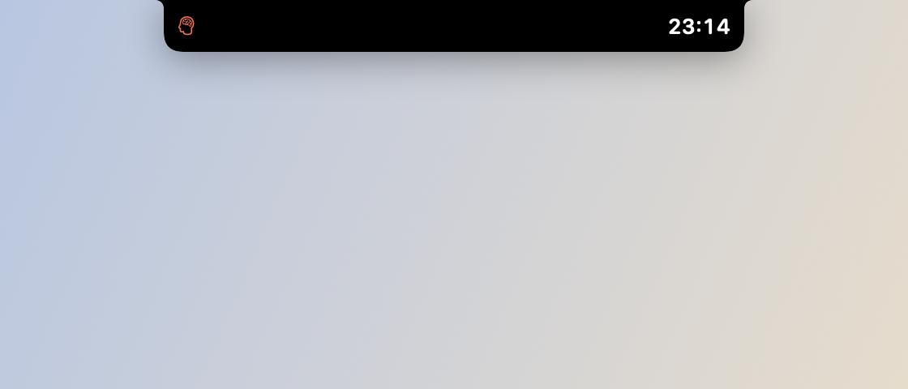
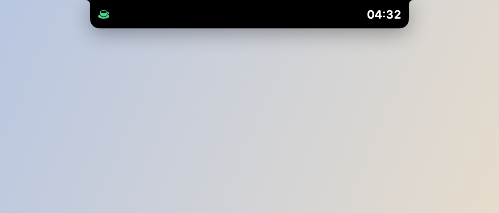
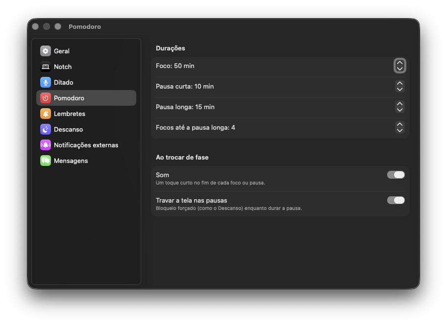

# Pomodoro

*Foco.*

*Pausa.*

*Ajustes → Pomodoro.*

## O que faz

Timer Pomodoro no notch: alterna foco → pausa curta → foco → … → pausa longa,
parando no fim de cada fase e esperando você iniciar a próxima manualmente
(não avança sozinho). Aparece como uma pílula compacta no notch fechado com o
tempo restante.

## Como usar

- Iniciar/pausar/pular fase: clique na pílula do Pomodoro no notch.
- Durações de foco/pausa curta/pausa longa e quantos ciclos até a pausa longa:
  Ajustes → Pomodoro.

## Permissões

Nenhuma permissão especial.
