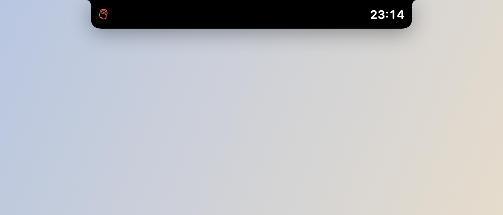
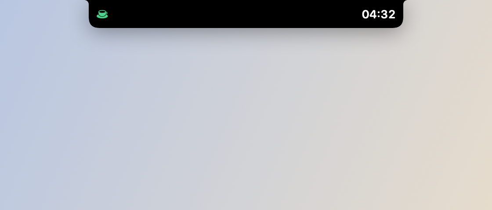
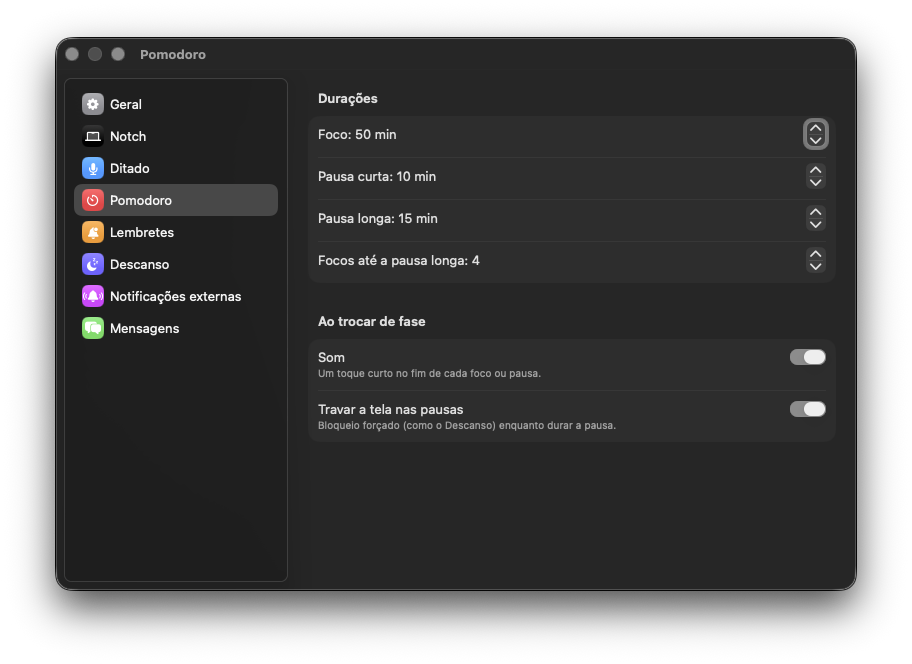
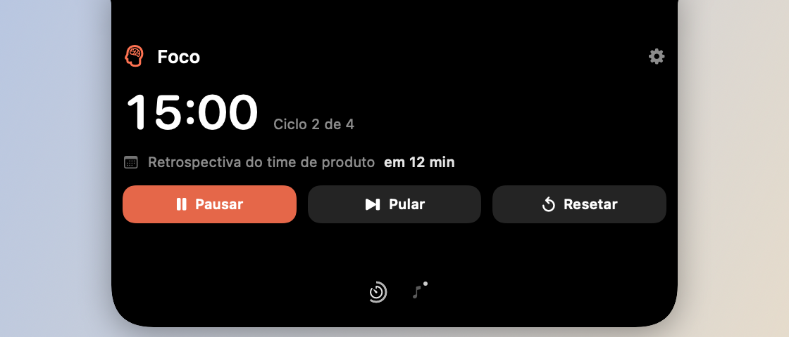
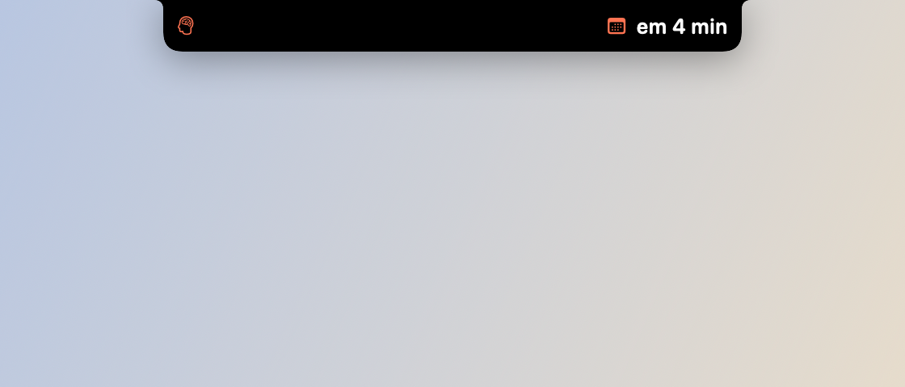

# Pomodoro

*Foco.*

*Pausa.*

*Ajustes → Pomodoro.*

## O que faz

Timer Pomodoro no notch: alterna foco → pausa curta → foco → … → pausa longa,
parando no fim de cada fase e esperando você iniciar a próxima manualmente
(não avança sozinho). Aparece como uma pílula compacta no notch fechado com o
tempo restante.

## Como usar

- Iniciar/pausar/pular fase: clique na pílula do Pomodoro no notch.
- Durações de foco/pausa curta/pausa longa e quantos ciclos até a pausa longa:
  Ajustes → Pomodoro.

## No card aberto

Com o timer rodando, o Pomodoro é uma **seção** do card aberto — o tempo
grande, o "Ciclo N de M" e os controles. Ele não some mais a música: as duas
convivem na faixa do rodapé e você escolhe qual fica na frente clicando no
ícone (ou deslizando dois dedos na horizontal).

Fora de foco, o ícone do timer na faixa mostra um **anel do tempo restante da
fase** — dá pra saber quanto falta sem tirar a música da tela.

Virar fase (foco → pausa e vice-versa) é um evento: o card recém-aberto põe o
Pomodoro na frente por alguns segundos. O tique do relógio, não — senão ele
moraria no topo pra sempre.

## Próximo evento do calendário

*A linha do evento entra entre o timer e os controles.*

*Faltando 5 minutos ou menos, o aviso toma o lugar do tempo restante.*

Enquanto o Pomodoro está ativo ele suprime a seção de atividade — que é onde o
[countdown de calendário](calendar-countdown.md) normalmente mora. Pra você não
ficar sem saber da reunião justamente durante o foco:

- **No card**: uma linha entre o timer e os controles com o título do evento e
  quanto falta ("Retrospectiva do time em 12 min"). Título comprido é cortado
  com reticências, os botões não se mexem.
- **Na pílula fechada**: nos últimos **5 minutos** o tempo restante da fase dá
  lugar ao aviso do evento ("em 4 min"). Passado o evento, o timer volta.

Vale a mesma janela de 15 minutos e o mesmo interruptor do countdown
(Ajustes → Notch): desligado ali, nada disso aparece.

Enquanto o Pomodoro está na tela, o anel de atividade do calendário fica
calado — o evento já está aqui, e como a atividade se atualiza a cada 30 s ela
subiria ao topo do card sem parar, tirando o timer da frente.

## Permissões

O timer em si não pede nada. A linha do próximo evento depende da permissão de
**Calendário**, a mesma do [countdown](calendar-countdown.md) — sem ela, o card
fica como sempre foi.
