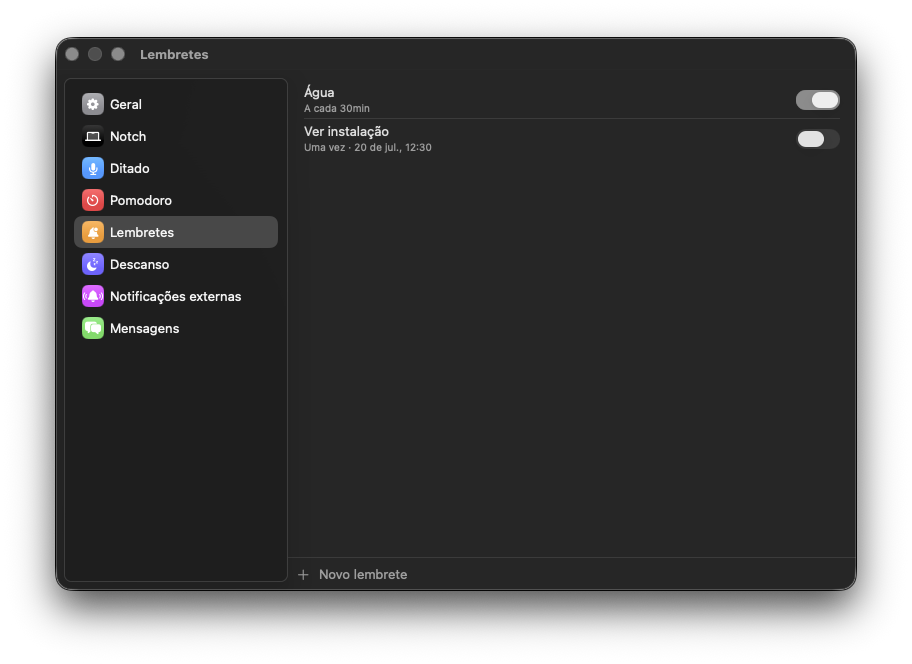

# Lembretes

## O que faz

Lembretes programados independentes do app Lembretes do macOS: uma vez, numa
recorrência (diária/semanal/mensal/anual) ou a cada N minutos. Tempo por
relógio de parede — um disparo perdido durante o sleep do Mac é simplesmente
pulado, nunca acumula/enfileira pra tocar tudo de uma vez ao acordar.

## Como usar

- Criar, editar, pausar (sem apagar) ou remover: Ajustes → Lembretes.
- Cada lembrete pode tocar um som e abrir uma URL ao clicar.

## Permissões

Nenhuma permissão especial (não usa o EventKit/app Lembretes do sistema — é
um agendador próprio).
