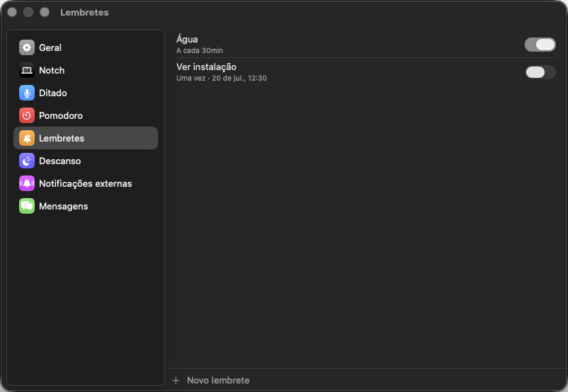

# Lembretes

## O que faz

Lembretes programados independentes do app Lembretes do macOS: uma vez, numa
recorrência (diária/semanal/mensal/anual) ou a cada N minutos. Tempo por
relógio de parede — um disparo perdido durante o sleep do Mac é simplesmente
pulado, nunca acumula/enfileira pra tocar tudo de uma vez ao acordar.

## Como usar

- Criar, editar, pausar (sem apagar) ou remover: Ajustes → Lembretes.
- Cada lembrete pode tocar um som e abrir uma URL ao clicar.
- Quando o lembrete dispara, o card no notch traz **Adiar 5 min** e **30 min** —
  o disparo é empurrado sem abrir os Ajustes. Adiar vale uma vez só: o lembrete
  volta pra agenda normal depois de tocar. O adiamento é gravado em disco e
  sobrevive a reiniciar o Knobler; se você editar o horário do lembrete com um
  adiamento no ar, ele continua valendo até vencer.

## Permissões

Nenhuma permissão especial (não usa o EventKit/app Lembretes do sistema — é
um agendador próprio).
