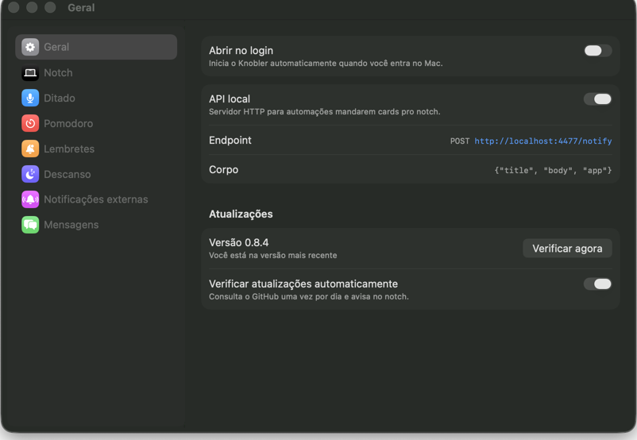
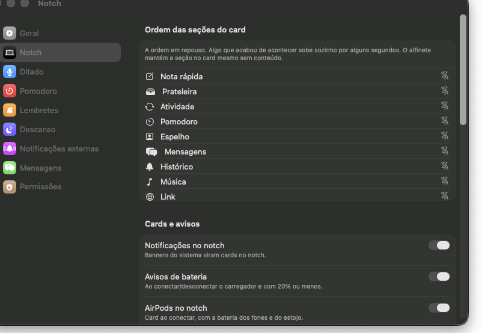
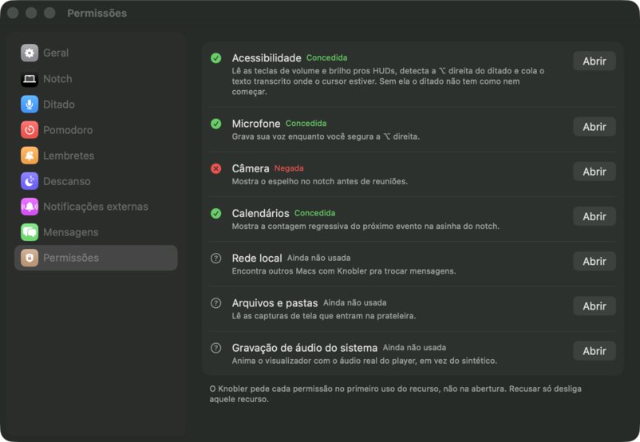

# Ajustes

*Geral.*

*Notch — liga/desliga cada feature individualmente.*

## O que faz

Janela única de configuração no estilo do Ajustes do Sistema: sidebar com
todos os painéis, detalhe em formulário agrupado à direita. Cada feature do
Knobler tem seu painel — os detalhes de cada um estão documentados na página
da própria feature, linkada abaixo.

## Como usar

- Abrir Ajustes: pelo menu do Knobler ou clicando na pílula do Pomodoro (que
  abre direto no painel de Pomodoro).
- Painéis e onde encontrar os detalhes de cada um:
  - **Geral** — login automático, versão do app, atualizações.
  - **Notch** — liga/desliga individualmente HUDs, notificações, countdown de
    calendário, **silêncio durante reuniões**, visualizador de áudio, API local,
    AirPods, screenshots na prateleira, espelho de câmera. Traz também a **ordem das seções do card
    aberto**: uma lista arrastável que define quem aparece primeiro quando não
    há evento recente promovendo ninguém. Ver `docs/huds.md`, `docs/notifications.md`,
    `docs/calendar-countdown.md`, `docs/now-playing.md`, `docs/local-api.md`,
    `docs/airpods.md`, `docs/shelf.md`, `docs/mirror.md`.
  - **Ditado** — ver `docs/dictation.md`.
  - **Pomodoro** — ver `docs/pomodoro.md`.
  - **Lembretes** — ver `docs/reminders.md`.
  - **Descanso** — ver `docs/descanso.md`.
  - **Notificações externas** — ver `docs/webhooks.md`.
  - **Mensagens** — nome/foto exibidos aos outros; ver `docs/messages.md`.
  - **Permissões** — estado de cada permissão que o app usa; ver abaixo.

## Atualizações

No painel **Geral**. O Knobler consulta o GitHub uma vez por dia e avisa quando
sai versão nova: um card desce do notch (uma vez por versão — **Depois** silencia
até a próxima) e a linha nos Ajustes fica lá enquanto o update existir.

**Atualizar** instala na hora e o app reinicia sozinho. Quem instalou pelo
Homebrew recebe o update pelo próprio `brew upgrade --cask knobler`, o que mantém
o Caskroom em dia; quem baixou o `.zip` recebe o download direto. Antes de trocar
o app, o Knobler confere de onde veio o download, a assinatura e o identificador
do que baixou — se algo não bater, nada é substituído e o card mostra o motivo.

Quando não dá pra instalar sozinho — sem Homebrew, release sem `.zip`, ou o app
rodando fora de `/Applications` — o botão vira **Ver release** e abre a página no
navegador. **Verificar agora** força uma checagem fora do ciclo diário, e o
toggle **Verificar atualizações automaticamente** desliga a checagem de vez.

> Depois de atualizar, o macOS pode pedir a permissão de **Acessibilidade** de
> novo (o ditado para em silêncio até você reconceder). Isso acontece quando a
> identidade de assinatura do app muda entre versões; ver
> [`troubleshooting.md`](troubleshooting.md).

## Permissões

*Permissões — o que o app usa, o estado de cada uma e o que quebra sem ela.*

O painel **Permissões** lista as oito permissões que o Knobler pode usar e o
estado atual de cada uma. Onde o macOS ainda aceita o pedido, aparece o botão
**Permitir**, que abre o balão do sistema ali mesmo — sem sair do app. O botão
**Abrir** leva ao painel certo do Ajustes do Sistema e continua sempre presente.

O **Permitir** só aparece em *Acessibilidade*, *Microfone*, *Câmera* e
*Calendários*, e só enquanto o estado for *Não solicitada*: o macOS mostra o
balão uma vez por app: depois que a permissão foi negada, a chamada não faz
nada e o Ajustes do Sistema é o único caminho. As outras quatro não têm API de
pedido — o Bluetooth é pedido pelo monitor dos AirPods na abertura, e Rede
local, Arquivos e pastas e Gravação de áudio do sistema só disparam o balão no
primeiro uso real do recurso.

O Knobler pede cada permissão **no primeiro uso do recurso**, não na abertura —
o microfone só quando você segura a ⌥ direita pela primeira vez, a câmera só ao
abrir o espelho, a rede local só ao pôr a seção Mensagens em foco. Recusar não
quebra o app: só desliga aquele recurso.

Duas fogem dessa regra. A **Acessibilidade** é pedida na abertura porque sem ela
o `CGEventTap` nem chega a ser criado — a ⌥ direita nunca chega ao app e não
existe "primeiro uso" que dê pra esperar, o ditado ficaria impossível de
acionar. É também a permissão que os HUDs de volume e brilho usam.

O **Bluetooth** é pedido na abertura junto com o monitor dos AirPods, que sobe
com o app quando **AirPods no notch** está ligado (o padrão) — o macOS pede
assim que o Knobler pergunta quais dispositivos estão pareados. Desligue a opção
em Ajustes › Notch se preferir não conceder.

Na **primeira abertura** o painel se apresenta sozinho. O Knobler roda como
agente (sem ícone no Dock, sem janela), então sem isso não há de onde partir pra
achar as permissões.

O painel também detecta **instalação fora do lugar** — app translocado pelo
Gatekeeper, rodando de fora de `/Applications`, ou ainda com a marca de
quarentena. Nesses estados o macOS descarta a concessão e o app **não aparece**
na lista do Ajustes do Sistema; um aviso no topo diz qual é o caso e como
resolver, e reaparece a cada abertura enquanto durar.

No rodapé, **Revelar o Knobler no Finder** existe pro caminho manual: o Ajustes
do Sistema só lista um app depois que ele pede a permissão, então quando o
Knobler não estiver na lista, abra o painel, clique em **+** e arraste o app.
**Copiar diagnóstico** copia o mesmo relatório de `Knobler --permissoes` (estado
das oito permissões + caminho do bundle), para suporte remoto.

Três permissões não expõem status ao app — **Rede local**, **Arquivos e pastas**
e **Gravação de áudio do sistema**. O macOS não oferece API para consultá-las, só
para usá-las. Elas aparecem como *Ainda não usada* até o recurso rodar uma vez;
a partir daí o painel mostra o resultado real.
