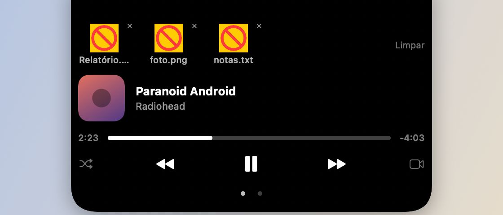

# Prateleira de arquivos (Shelf)

## O que faz

Uma prateleira de arquivos temporários no notch: arraste um arquivo pro notch
e ele expande sozinho; o item fica guardado no card aberto até você arrastar
de volta pro Finder (ou pra outro app). Screenshots novos também podem cair
direto na prateleira automaticamente (observados via Spotlight, sem polling),
prontos pra arrastar em vez de precisar ir até a área de trabalho.

## Como usar

- Arraste qualquer arquivo em direção ao notch — ele expande e aceita o drop.
- Arraste um item da prateleira de volta pra fora (Finder, outro app) pra
  "tirar" ele de lá.
- Screenshots caírem automaticamente na prateleira: Ajustes → Notch
  (`screenshotsToShelf`).

## Permissões

Nenhuma permissão especial. (O app roda sem sandbox — os caminhos dos
arquivos da prateleira ficam em UserDefaults, não em bookmarks
security-scoped.)
