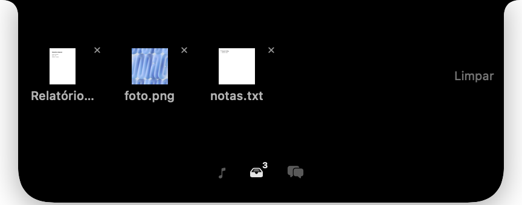

# Prateleira de arquivos (Shelf)



*A prateleira em foco, com a faixa de seções no rodapé.*

> Esta imagem não sai do `tools/snapshot.sh`: as miniaturas dependem do
> `QLThumbnailGenerator`, que não renderiza offscreen (o `foco-shelf.png` do
> harness sai com o ícone de "proibido" no lugar delas). Recaptura é manual, no
> app rodando — ver a receita em `CLAUDE.md`.

## O que faz

Uma prateleira de arquivos temporários no notch: arraste um arquivo pro notch
e ele expande sozinho; o item fica guardado no card aberto até você arrastar
de volta pro Finder (ou pra outro app). Screenshots novos também podem cair
direto na prateleira automaticamente (observados via Spotlight, sem polling),
prontos pra arrastar em vez de precisar ir até a área de trabalho.

## Como usar

- Arraste qualquer arquivo em direção ao notch — ele expande e aceita o drop.
- Arraste um item da prateleira de volta pra fora (Finder, outro app) pra
  "tirar" ele de lá.
- Screenshots caírem automaticamente na prateleira: Ajustes → Notch
  (`screenshotsToShelf`).
- A prateleira é uma **seção** do card aberto. Se ela não estiver em foco, o
  ícone de bandeja na faixa do rodapé mostra a **contagem de itens** — clicar
  traz a prateleira pra frente. Arquivo novo (arrastado ou screenshot
  capturado) conta como evento: o card recém-aberto põe a prateleira na
  frente por alguns segundos.
- **Botão direito** (ou Control+clique) na miniatura abre o menu:

```
Converter     ▸ …                       (só quando o tipo tem conversão)
Compartilhar  ▸ Enviar por AirDrop
                Compartilhar…           (menu nativo: Mensagens, Mail, Notas…)
                Enviar tudo por AirDrop (N)   ← a partir de 2 itens
──────────────
Mostrar no Finder
Remover do shelf
```

### Converter

Os destinos dependem do tipo do arquivo:

| Arquivo | Vira |
|---|---|
| imagem (PNG, JPEG, HEIC…) | PNG · JPEG · HEIC · PDF |
| PDF | PNG — uma imagem por página, em 2x |
| vídeo | MP4 · MOV |
| Markdown (`.md`, `.markdown`) | PDF |

O formato atual nunca aparece na lista.

Escolher um destino **não grava nada ainda**: a prateleira entra em modo preview
e mostra o resultado — miniatura, tamanho antes/depois e dimensão — com os
presets ao lado. Só **Salvar** move o arquivo pra junto do original, com nome
livre (`foto-1.png` se `foto.png` já existir), e o põe na prateleira; o original
nunca é tocado. **Descartar** apaga tudo e não deixa rastro no disco. Enquanto
espera, o convertido vive numa pasta temporária.

| Preset | Vale pra | O que muda |
|---|---|---|
| Qualidade — Alta / Média / Baixa | JPEG e HEIC | compressão (0,9 / 0,7 / 0,5) |
| Tamanho — 100% / 50% / 25% | imagem, PDF→PNG e vídeo | dimensão do resultado |

Cada linha só aparece onde muda alguma coisa: PNG e PDF são lossless (sem
qualidade), PDF de Markdown sai vetorial (sem tamanho). **Vídeo não tem linha de
qualidade** — o `AVAssetExportSession` não expõe bitrate, e os presets que o
exporiam carregam teto de resolução próprio, que faria o "50%" mentir.

Trocar um preset reconverte na hora e atualiza os números. Vídeo é o único que
demora: ele mostra barra de progresso no lugar do tamanho, e trocar de preset no
meio cancela o export anterior. Em 100% o vídeo sai por remux instantâneo, sem
recodificar.

PDF com várias páginas converte **todas**, e o card avisa quantas ("+5 pág.").
Salvar grava todas ao lado do original; só a primeira entra na prateleira, senão
um PDF de 30 páginas empurraria todo o resto pra fora.

O Markdown é renderizado pelo próprio app (parser do Foundation + TextKit):
cabeçalhos, negrito/itálico, código, listas, citação, tabela, regra horizontal e
imagem embutida, paginado em Letter. A imagem sai do caminho relativo ao próprio
`.md` (link remoto não é baixado — a conversão não faz rede) e é reduzida pra
caber na largura da página. Coluna de tabela tem largura fixa, dividida em
partes iguais; o alinhamento (`:---`, `---:`) é respeitado.

## Permissões

Nenhuma permissão especial. (O app roda sem sandbox — os caminhos dos
arquivos da prateleira ficam em UserDefaults, não em bookmarks
security-scoped.)
