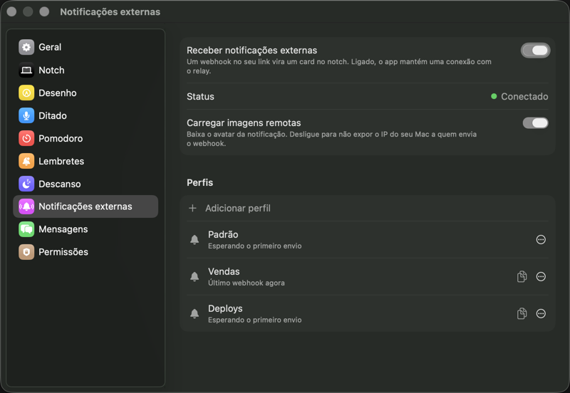
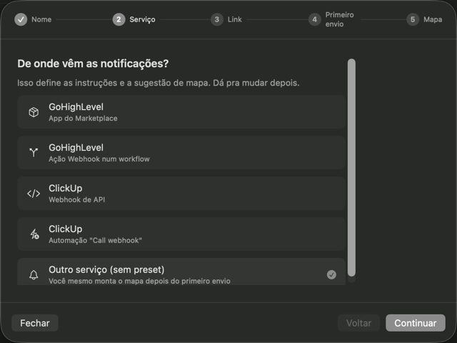
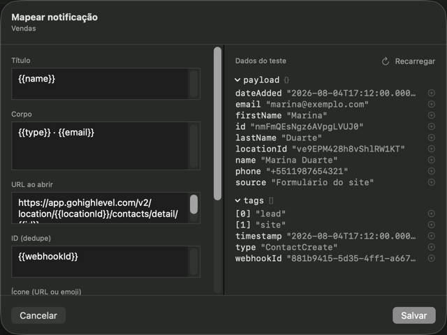

# Notificações externas (Webhooks)

*Ajustes → Notificações externas — lista de perfis.*

## O que faz

Cada "perfil" webhook tem um link próprio (`push.appzoi.com.br/w/<token>`):
qualquer serviço externo (Zapier, GHL, um script de deploy) que faça POST
nesse link vira um card de notificação no notch, sem precisar da API local
`127.0.0.1:4477` (que só funciona na mesma máquina). O mapeamento define quais
campos do JSON recebido viram título, corpo, ícone, etc. do card. A conexão
com o relay usa um WebSocket sempre ativo, com reconexão automática.

## Como usar

Ligue **Receber notificações externas** e clique em **Adicionar perfil**. O
assistente é a porta única — cinco passos, na ordem em que a configuração
realmente acontece:

1. **Nome** — como você chama esse perfil. Um por serviço costuma bastar.
2. **Serviço** — de onde vêm as notificações. Escolher um preset traz a
   instrução certa e semeia o mapa. Quem não está na lista escolhe
   **Outro serviço (sem preset)** e monta o mapa depois do primeiro envio.
3. **Link** — copie o link do perfil e cole no serviço externo.
4. **Primeiro envio** — o assistente fica esperando o primeiro POST chegar
   (dá pra fechar: o perfil continua esperando e o painel retoma daqui). Sem
   esperar, **Colar JSON de exemplo** monta o mapa a partir de um payload que
   você já tenha em mãos.
5. **Mapa** — o editor, com a árvore do que chegou de um lado e os campos do
   card do outro.

*Passo 2 — o preset define instruções e sugestão de mapa.*

Depois, na lista de perfis: **Mapear campos…** reabre o editor,
**Gerar link novo…** invalida o link antigo e **Apagar perfil** remove tudo.

### O editor de mapa

*Mapear um perfil — como o JSON recebido vira o card.*

Clicar num valor da árvore insere o `{{caminho}}` dele no campo em foco. O
que já chegou fica em **Dados do teste** (**Recarregar** busca o mais recente).
Campos vazios ganham **sugestões automáticas** — do preset quando ele casa com
o payload, senão por nome de chave — num banner que some ao primeiro toque.
Campo já preenchido nunca é sobrescrito, e o ícone nunca é chutado.

## Presets

Um preset é a receita de um serviço conhecido: a instrução de onde colar o
link, a ressalva do que costuma dar errado, um JSON de exemplo e a sugestão de
mapa. Hoje vêm quatro no app:

| Serviço | Caminho |
|---|---|
| GoHighLevel | App do Marketplace |
| GoHighLevel | Ação Webhook num workflow |
| ClickUp | Webhook de API |
| ClickUp | Automação "Call webhook" |

Um mesmo serviço aparece mais de uma vez porque o **caminho** muda o payload —
o webhook de um workflow do GHL não tem o mesmo corpo do app do Marketplace. A
ressalva de cada preset diz o que esperar (no GHL, por exemplo, quase todo
campo é opcional e o corpo muda por evento).

O preset é ponto de partida, não vínculo: o mapa sugerido é editável e
**reaplicar um preset é manual** — trocar o serviço no assistente não reescreve
um mapa que você já salvou.

## Filtros no template

Um `{{caminho}}` aceita um filtro: `{{caminho | filtro}}`. A lista é fechada,
um filtro por token, sem argumentos e sem encadeamento. Filtro desconhecido ou
inaplicável devolve o valor cru — falha suave, nunca erro na tela.

| Filtro | Faz | Exemplo |
|---|---|---|
| `semHifens` | Tira todos os `-` | `{{webhookId \| semHifens}}` → `881b94155d354ff1…` |
| `data` | Epoch em ms → `DD/MM/AAAA HH:MM` na hora local | `{{date_created \| data}}` → `04/08/2026 14:12` |
| `quill` | Delta do Quill (ClickUp) → texto puro | `{{comment \| quill}}` → `Cliente pediu retorno` |

O app e o relay aplicam os mesmos três filtros — a prévia do editor mostra o
que o card vai mostrar.

## Quando o painel diz "Credenciais inacessíveis"

Os três segredos do pareamento (`deviceId`, `deviceSecret`, `publishToken`) têm
uma ACL presa ao requisito de assinatura de quem os gravou. Se a assinatura do
app mudar — passar a ser notarizado com Developer ID, por exemplo — a ACL deixa
de bater e o Keychain não abre mais os itens. O app lê com a interação
desligada, então em vez do diálogo de senha do macOS aparece o aviso no painel,
com o botão **Parear de novo**.

Ele **não** re-pareia sozinho de propósito: o `publishToken` é a URL pública que
você já colou nos serviços externos, e um registro novo a invalidaria em
silêncio. Clicar em **Parear de novo** troca o link — os POSTs para o link
antigo param de chegar, e é preciso atualizar o serviço externo.

Distinguir "nunca pareado" de "pareado mas trancado" é decisão de
`WebhookKeychainStore.pairingState()`, coberta pelo `webhookcheck`.

## Operar o relay

Manter o serviço de pé (pm2, banco, backup, limites) está em
[Operação do relay](relay-operacao.md).

## Permissões

Nenhuma permissão especial (usa rede normal, sem entitlement de sistema).
Os segredos de pareamento ficam no Keychain, nunca em UserDefaults ou log.
